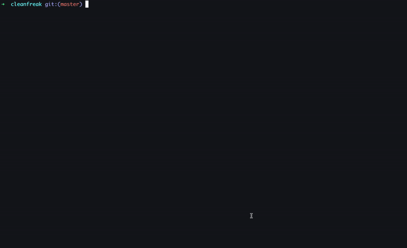

<h1 align="center">
  CleanFreak
</h1>

<div align="center">
  <p>
    
    
    

  </p>
</div>

An opinionated workspace organisation and cleaning utility. (Work in progress, please be gentle.)

## Setup

<div align="center">
  
</div>

## Diagnosing and Cleaning

<div align="center">
  
</div>

## Installation

### Manual

Requires an installation of golang. To install golang and to setup your go environment, reference the golang documentation here:

`https://go.dev/doc/install`

This process assumes that GOPATH contains `bin` and that GOPATH has been added to the user's PATH.

```
git clone https://github.com/Schalk1e/cleanfreak.git
cd cleanfreak
go build -o $GOPATH/bin/cf
```

### macOS

Note that, for trash support, terminal might need the full disk access setting enabled under the user's security and privacy settings.

## Usage

### View CleanFreak Help

`cf`  or `cf -h`

### Diagnose System

`cf diagnose`

### Run Clean

Before executing clean, cf will prompt the user to first execute `cf init` to initialise a cleanfreak directory that it will manage. The config file for this directory will be created in $HOME/.cleanfreak.yaml if no config is provided. Else, the user may specify his or her own config path and pass it to `cf init`.

The user may execute a specific task, for example:

`cf clean trash`

Or allow the system to execute all tasks bu running:

`cf clean all`

# TODO

- Tests.
- Coverage Badge
- Versioned Release
- WSL does not have desktop or trash. Add checks when files do not exist...
- Add trash support for windows.
- Migrate survey dependency to https://github.com/charmbracelet/bubbletea
